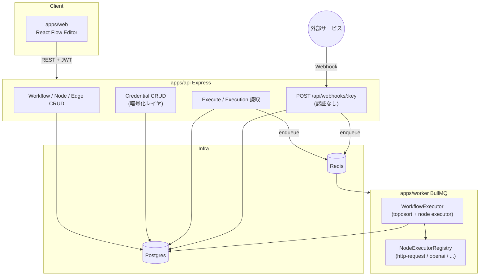
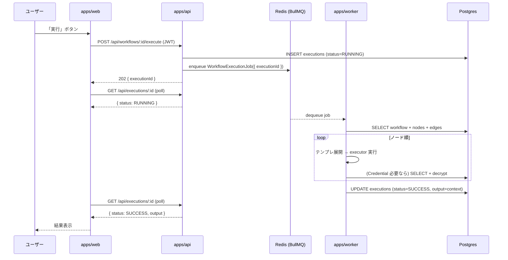
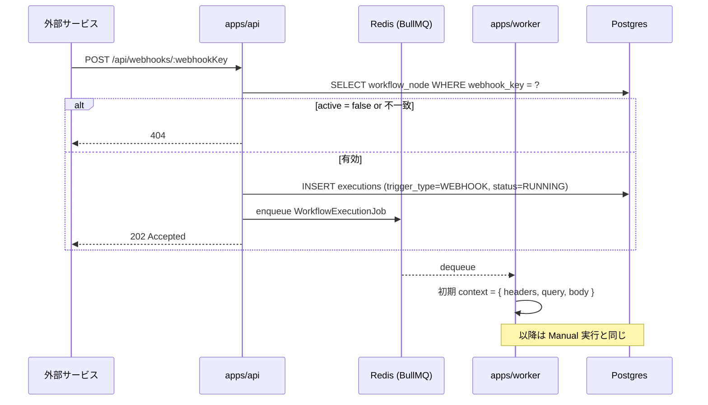

# nodebase-core: ワークフロー自動化プラットフォーム

n8n クローンを目指す、ノードベースのワークフロー自動化プラットフォームの中核機能。ユーザーは React Flow のキャンバス上にトリガー / アクションノードを配置・接続し、保存したワークフローを **手動 / Webhook 経由** で実行できる。実行結果はノードごとにステータス・出力データ・エラーが履歴として残る。

このドキュメントは **仕様（What）** と **設計（How）** を分けて記述する：

- **仕様**：ユーザーから見える挙動・ルール・データの意味
- **設計**：実装にあたっての技術的な選択と制約

## 関連 spec

- [`../shared-packages/README.md`](../shared-packages/README.md) — `@repo/db` / `@repo/queue` / `@repo/redis` / `@repo/logger` / `@repo/errors` 等を利用する。Prisma / Worker / Job キューはこの基盤に乗る
- [`../dev-login/README.md`](../dev-login/README.md) — 開発時の認証経路。Workflow / Credential は `userId` でスコープされ、JWT cookie で認証された User に紐づく

## 目次

- [仕様](#仕様)
  - [ユースケース](#ユースケース)
  - [ワークフロー](#ワークフロー)
  - [ノードの種類（MVP）](#ノードの種類mvp)
  - [トリガーと起動経路](#トリガーと起動経路)
  - [実行とコンテキスト伝播](#実行とコンテキスト伝播)
  - [Credential（秘密情報の保管）](#credential秘密情報の保管)
  - [実行履歴](#実行履歴)
  - [権限・スコープ](#権限スコープ)
- [設計](#設計)
  - [アーキテクチャ全体像](#アーキテクチャ全体像)
  - [Reference との対応](#reference-との対応)
  - [DAG 実行エンジン（apps/worker）](#dag-実行エンジンappsworker)
  - [Credential 暗号化](#credential-暗号化)
  - [Webhook 受信経路](#webhook-受信経路)
  - [テンプレート展開（context 参照）](#テンプレート展開context-参照)
  - [冪等性とリトライ](#冪等性とリトライ)
  - [MVP 対象外（将来検討）](#mvp-対象外将来検討)
- [必要な画面](#必要な画面)
- [必要な API](#必要な-api)
- [必要な DB 設計](#必要な-db-設計)
- [フロー図](#フロー図)

---

## 仕様

### ユースケース

- ノンエンジニアのユーザーが、UI 上でドラッグ&ドロップでノードを並べてワークフローを組む
- ボタンを押す（Manual Trigger）か、外部サービスから Webhook を受け取って起動する
- 各ノードは前のノードの出力を変数として参照できる（例: `{{httpResponse.body.id}}`）
- 実行が失敗した場合、どのノードでどんなエラーが出たかが履歴から追える

### ワークフロー

| 概念 | 説明 |
| --- | --- |
| **Workflow** | ノードとエッジ（接続）で構成される DAG。1 ユーザーが複数所有 |
| **Node** | 単一の処理単位（HTTP リクエスト送信、AI への問い合わせ等） |
| **Edge** | ノード間の接続。実行順を決め、前ノードの出力を後ノードに伝える |
| **Active フラグ** | ワークフローを起動可能（true）／編集中で起動不可（false） |

- 1 つの Workflow には **トリガーノードが 1 つ以上** 必要
- トリガーノードのみが「最初の入力」を受け取り、他のノードは前ノードの出力を受け取る
- ノード/エッジの構成にサイクル（循環）があってはならない

### ノードの種類（MVP）

| カテゴリ | 種別 | 設定項目 | 出力 |
| --- | --- | --- | --- |
| トリガー | **Manual Trigger** | （なし） | `{ triggeredAt }` |
| トリガー | **Webhook Trigger** | `webhookKey`（URL の一部、UUID 自動生成）, `method` (GET/POST) | `{ headers, query, body }` |
| アクション | **HTTP Request** | `url`, `method`, `headers (JSON)`, `body (text)` | `{ status, headers, body }` |
| アクション | **OpenAI** | `credentialId`, `model`, `systemPrompt`, `userPrompt` | `{ text, usage }` |

- ノードはユーザーから見て名前（`name`）と「変数名」（`variableName`、context 上のキー）を持つ
- `variableName` のデフォルトは `node1` / `node2` … と自動採番。ユーザーは編集可能
- `systemPrompt` / `userPrompt` / `url` / `body` などのテキストフィールドは **Handlebars テンプレート構文** で前ノードの出力を参照できる（例: `{{trigger.body.email}}`）

### トリガーと起動経路

| トリガー | 起動経路 | 初期 context |
| --- | --- | --- |
| Manual | エディタの「実行」ボタン → `POST /api/workflows/:id/execute` | `{}` |
| Webhook | `POST /api/webhooks/:webhookKey`（外部から） | `{ headers, query, body }` |

- Webhook URL は **ユーザーごと一意ではなく、トリガーノードごと一意**（`webhookKey` を持つ）
- Workflow が `active = false` のときの Webhook は **404** を返す（外部に存在を知らせない）
- Manual 実行は Workflow が `active = false` でも可能（テスト用途）

### 実行とコンテキスト伝播

- 1 回の実行は **1 つの Execution レコード** で表現される（status: `RUNNING` / `SUCCESS` / `FAILED`）
- 実行中は DAG をトポロジカルソートし、ノードを順に実行する
- 各ノードの出力は context の `<variableName>` キーに格納される
  - 例: HTTP Request ノード（variableName: `httpA`）の出力は `context.httpA = { status, headers, body }`
- 後続ノードのテンプレートフィールド（`{{httpA.body.id}}`）は実行時に展開される
- どこかのノードが throw した場合、それ以降のノードは実行されず Execution は `FAILED` で停止

### Credential（秘密情報の保管）

- OpenAI API key などの秘密情報は **平文で DB に持たない**。AES 対称鍵暗号で保存
- Credential は **type ごと**（`OPENAI` / `WEBHOOK_SECRET` 等）に管理し、ノードからは `credentialId` で参照
- Credential も `userId` でスコープされ、他ユーザーのものは参照できない
- UI 上では値の入力時のみ平文、保存後は **マスクされた表示**（`sk-xxx****`）

### 実行履歴

- 履歴一覧画面で「ワークフロー名 / 開始時刻 / 完了時刻 / ステータス」を時系列表示
- 詳細画面で「どのノードまで成功したか」「失敗したノードのエラー内容」「最終 context（JSON）」を確認できる
- 履歴は **直近 100 件まで** ユーザーごとに保持（MVP は保持上限のみ。古いものから自動削除は将来）

### 権限・スコープ

- すべてのリソース（Workflow / Node / Edge / Credential / Execution）は **`userId` でスコープ**
- 他ユーザーのリソースは API から 404 として隠す（403 ではなく 404）

---

## 設計

### アーキテクチャ全体像



### Reference との対応

`/Users/kentafujimori/workspace/local/project/reference/nodebase` は Next.js 単体・tRPC・Inngest 構成。本プロジェクトの責務分割に合わせて再設計する。

| Reference | 本プロジェクト |
| --- | --- |
| tRPC + Next.js Server Component | Express REST（`apps/api`） + React Query（`apps/web`） |
| Better Auth | 既存 JWT 認証（`apps/api/src/middleware/auth`） |
| Inngest Function（DAG 実行） | BullMQ Job（`apps/worker` の WorkflowExecutor） |
| Inngest Channel / Realtime status | **MVP では polling**（`GET /api/executions/:id`）。リアルタイム化は deferred |
| Cryptr | Node 標準 `crypto` (AES-256-GCM) を `apps/api/src/lib/encryption.ts` に実装 |
| `@xyflow/react`（React Flow） | 同じ。`apps/web` に置く |
| `toposort` パッケージ | 同じ。`apps/worker` に置く |
| 各種チャンネル / executor が同一ファイル内 | **node-executor を `packages/queue/src/jobs/` の job 型と、`apps/worker/src/workers/` の実装に分離** |
| `prisma/schema.prisma`（reference） | `packages/db/prisma/schema.prisma`。命名は snake_case + `@@map` を必ず付ける |

### DAG 実行エンジン（apps/worker）

- `packages/queue` の `JobQueue<WorkflowExecutionJob>` を介して `workflow-execution` キューに enqueue
- ジョブのペイロードは `{ executionId }` のみ。残りはワーカーが DB から読む（payload の肥大化と機微情報漏出を防ぐ）
- ワーカーは
  1. `Execution` を `RUNNING` に更新
  2. `workflow.nodes` + `workflow.edges` を取得し、`toposort` でノード順序を決定
  3. 各ノードに対応する `NodeExecutor` を `NodeExecutorRegistry` から取得して実行
  4. 出力を `context[<variableName>]` に格納
  5. 全成功で `Execution` を `SUCCESS` に更新、`output` カラムに最終 context を保存
  6. throw が発生したら `FAILED` に更新、`error` / `errorStack` / `failedNodeId` を保存
- **`NodeExecutor` インタフェース**:
  ```ts
  type NodeExecutor<TConfig, TOutput> = (params: {
    config: TConfig
    context: WorkflowContext
    nodeId: string
    userId: number
    deps: { credentialRepository: CredentialRepository, logger: ILogger }
  }) => Promise<TOutput>
  ```
- ノード追加時は `NodeType` enum + 対応する Executor + バリデーション schema を 1 セットで足す

### Credential 暗号化

- 暗号方式: **AES-256-GCM**（authenticated encryption）。鍵は `ENCRYPTION_KEY`（32 byte hex）を env から読む
- 保存形式: `iv:authTag:ciphertext`（base64 url-safe）
- 暗号化 / 復号は `apps/api/src/lib/encryption.ts` の `encrypt(plain): string` / `decrypt(encoded): string` で完結
- 復号は **Worker 側でも実行**（API key を API → Worker に payload で渡さない）。両方が `ENCRYPTION_KEY` を共有する
- 取り出し API（`GET /api/credentials/:id`）は **マスク済み値** のみ返す。平文は API 越しに出さない

### Webhook 受信経路

- 公開 URL: `POST /api/webhooks/:webhookKey`（**認証なし**、`webhookKey` で識別）
- `webhookKey` は Workflow 作成時または「Webhook Trigger ノード追加時」に **サーバ側で UUID v4 を発番**
- 受信時の処理（同期で完結する部分のみ）:
  1. `webhookKey` で `Node` を引き、その Workflow を解決
  2. `workflow.active === false` なら **404**
  3. `Execution` を `RUNNING` で作成
  4. `WorkflowExecutionJob`（`{ executionId }`）を enqueue
  5. **202 Accepted**（ボディは `{ executionId }`）を即座に返却（外部サービスの reply timeout を防ぐ）
- 4xx を返す条件: `webhookKey` 不一致 → 404。method 不一致 → 405。リクエスト過大 → 413
- Webhook の `body` パース上限: **256 KB**（Express の `body-parser` で制御）

### テンプレート展開（context 参照）

- テンプレートエンジンは **Handlebars**（reference と同じ）
- 展開対象フィールド: `url` / `body` / `headers` / `systemPrompt` / `userPrompt` 等のテキスト
- 展開タイミング: ノード実行直前。`Handlebars.compile(field)(context)` で評価
- **未定義変数の扱い**: デフォルトは空文字に展開。`{ strict: true }` にはしない（部分実行時の互換性のため）
- **escape**: HTTP body / Prompt 等は **HTML エスケープしない**（`{{{var}}}` トリプル相当）。reference 同様、ユーザー入力テンプレートはエスケープ不要

### 冪等性とリトライ

- BullMQ ジョブの自動リトライは **有効にしない**（HTTP リクエスト等、副作用のある操作の二重実行を避ける）
- ノードが throw した場合は Execution を即座に `FAILED` で確定し、再実行はユーザー操作で行う（リトライボタンは deferred）
- Webhook が同一イベントを複数回送る可能性に対する dedup は **MVP では行わない**（外部サービス側の at-least-once を受け入れる）

### MVP 対象外（将来検討）

以下は MVP では実装しない。詳細とトリガー条件は [`./deferred-advanced-nodes.md`](./deferred-advanced-nodes.md) / [`./deferred-realtime-status.md`](./deferred-realtime-status.md) を参照。

- 追加ノード: Slack / Discord / Anthropic / Gemini / Stripe Trigger / Google Form Trigger
- ノード実行ステータスのリアルタイム表示（Inngest Realtime 相当）
- Cron トリガー
- ワークフローのインポート / エクスポート（JSON）
- 課金 / プラン制限（Polar）
- ノード単位のリトライ・部分再実行
- 履歴の自動削除ジョブ（`apps/cron`）

---

## 必要な画面

| 画面 | パス | 概要 |
| --- | --- | --- |
| ワークフロー一覧 | `/workflows` | 自分のワークフロー一覧。新規作成 / 削除 / active 切替 / 名前変更 |
| ワークフローエディタ | `/workflows/:workflowId` | React Flow キャンバス。ノード追加・接続・設定編集・実行 |
| Credential 一覧 | `/credentials` | Credential の追加 / 削除（値の編集は不可、削除→再作成） |
| 実行履歴一覧 | `/executions` | 自分の全 Workflow の実行履歴を時系列表示 |
| 実行履歴詳細 | `/executions/:executionId` | ノード別ステータスと最終 context（JSON）を表示 |

UI 仕様（色、レイアウト、各ノードのダイアログ）は `design-mock` skill で後追い決定する。

## 必要な API

### Workflow CRUD

| メソッド | パス | 概要 |
| --- | --- | --- |
| GET | `/api/workflows` | 自分の Workflow 一覧 |
| POST | `/api/workflows` | 新規作成（空のキャンバス + Manual Trigger 1 つで初期化） |
| GET | `/api/workflows/:id` | nodes / edges を含むワークフロー詳細 |
| PATCH | `/api/workflows/:id` | name / active の更新 |
| DELETE | `/api/workflows/:id` | 削除（cascade で node / edge / execution も削除） |

### Node / Edge CRUD（Workflow 内）

| メソッド | パス | 概要 |
| --- | --- | --- |
| POST | `/api/workflows/:id/nodes` | ノード追加 |
| PATCH | `/api/workflows/:id/nodes/:nodeId` | ノード更新（position / data / variableName 等） |
| DELETE | `/api/workflows/:id/nodes/:nodeId` | ノード削除（関連 edge も削除） |
| POST | `/api/workflows/:id/edges` | エッジ追加 |
| DELETE | `/api/workflows/:id/edges/:edgeId` | エッジ削除 |

### Credential

| メソッド | パス | 概要 |
| --- | --- | --- |
| GET | `/api/credentials` | 一覧（値はマスク） |
| POST | `/api/credentials` | 新規作成（`value` を暗号化して保存） |
| DELETE | `/api/credentials/:id` | 削除（紐づくノードがあっても削除、ノード側の credentialId は null に） |

### Execution

| メソッド | パス | 概要 |
| --- | --- | --- |
| POST | `/api/workflows/:id/execute` | Manual 実行。`{ executionId }` を即返却（202） |
| GET | `/api/executions` | 自分の実行履歴一覧（pagination） |
| GET | `/api/executions/:id` | 実行詳細（status / output / error / startedAt / completedAt） |

### Webhook（公開・認証なし）

| メソッド | パス | 概要 |
| --- | --- | --- |
| GET / POST | `/api/webhooks/:webhookKey` | 外部からの Webhook 受信。202 Accepted。Workflow が inactive なら 404 |

## 必要な DB 設計

| テーブル | 主要カラム | 説明 |
| --- | --- | --- |
| `users` | `id`, `email`, ... | 既存。今回追加なし |
| `workflows` | `id`, `user_id`, `name`, `active`, `created_at`, `updated_at` | ワークフロー本体 |
| `workflow_nodes` | `id`, `workflow_id`, `node_type`, `name`, `variable_name`, `position_x`, `position_y`, `data` (jsonb), `credential_id`, `webhook_key` | ノード。`data` にノード固有設定 |
| `workflow_edges` | `id`, `workflow_id`, `from_node_id`, `to_node_id` | エッジ。MVP では複数出力ポートは持たない（main のみ） |
| `credentials` | `id`, `user_id`, `name`, `type`, `encrypted_value` | 暗号化済み秘密情報 |
| `executions` | `id`, `workflow_id`, `user_id`, `status`, `trigger_type`, `started_at`, `completed_at`, `output` (jsonb), `error`, `error_stack`, `failed_node_id` | 実行履歴 |

```mermaid
erDiagram
    USERS ||--o{ WORKFLOWS : owns
    USERS ||--o{ CREDENTIALS : owns
    USERS ||--o{ EXECUTIONS : owns
    WORKFLOWS ||--o{ WORKFLOW_NODES : has
    WORKFLOWS ||--o{ WORKFLOW_EDGES : has
    WORKFLOWS ||--o{ EXECUTIONS : produced
    WORKFLOW_NODES ||--o{ WORKFLOW_EDGES : from
    WORKFLOW_NODES ||--o{ WORKFLOW_EDGES : to
    CREDENTIALS ||--o{ WORKFLOW_NODES : referenced_by

    USERS {
        int id PK
        string email
    }
    WORKFLOWS {
        string id PK
        int user_id FK
        string name
        boolean active
        timestamp created_at
        timestamp updated_at
    }
    WORKFLOW_NODES {
        string id PK
        string workflow_id FK
        string node_type
        string name
        string variable_name
        float position_x
        float position_y
        jsonb data
        string credential_id FK
        string webhook_key
    }
    WORKFLOW_EDGES {
        string id PK
        string workflow_id FK
        string from_node_id FK
        string to_node_id FK
    }
    CREDENTIALS {
        string id PK
        int user_id FK
        string name
        string type
        string encrypted_value
    }
    EXECUTIONS {
        string id PK
        string workflow_id FK
        int user_id FK
        string status
        string trigger_type
        timestamp started_at
        timestamp completed_at
        jsonb output
        string error
        string error_stack
        string failed_node_id
    }
```

- ID 型: `workflows` / `workflow_nodes` / `workflow_edges` / `credentials` / `executions` は **cuid2 文字列**（reference と互換 + URL に出やすい）
- `users.id` は既存（autoincrement int）に合わせる
- `node_type`, `status`, `trigger_type` は **string + Zod enum** で表現（Prisma enum は migration が面倒なので使わない）
- ユニーク: `workflow_nodes.webhook_key`（webhook ノードのみ非 NULL）

## フロー図

### Manual 実行のフロー



### Webhook 実行のフロー


